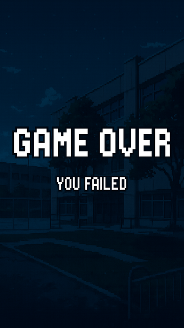

# 🏁 Race for Approval

**Race for Approval** é um mini game em estilo arcade feito com Python e Pygame. O jogador controla um personagem que precisa coletar PDFs e códigos enquanto desvia de obstáculos como cobras (Ekans) e carros. O objetivo final é **atingir 10 pontos** para ser aprovado. Se a vida do personagem chegar a 0, o jogo acaba com uma tela de **Game Over**.

## 🎮 Imagens do Jogo

### Tela Inicial


### Tela de Vitória


### Tela de Game Over


### Gameplay
- Personagem controlado pelo mouse
- Animações de movimento
- Sistema de pontuação e vida
- Sons para colisões e pontos
- Fundo animado em loop
- Transição entre cenas

---

## 📁 Estrutura de Pastas

```
Race for Approval/
│
├── assets/
│   ├── background.jpg
│   ├── boneco1.png
│   ├── carro.png
│   ├── code.png
│   ├── ekans1.png
│   ├── pdf.png
│   ├── tela inicio.png
│   ├── game_over.png
│   ├── win.png
│   └── Sons/
│       ├── musica.mp3
│       ├── pontos.mp3
│       └── dano.mp3
│
├── game.py
├── main.py
├── menu.py
├── obj.py
└── README.md
```
## Bibliotecas usadas:
- pygame
- random
---

## 🚀 Como Jogar

1. **Requisitos**:
   - Python 3.10+
   - Biblioteca [pygame](https://www.pygame.org/)

2. **Instalação das dependências**:
   ```bash
   pip install pygame
   ```

3. **Executar o jogo**:
   ```bash
   python main.py
   ```

---

## 🕹️ Controles

- **Mouse**: Move o personagem
- **Qualquer tecla**: Avança entre as telas (início, vitória ou derrota)

---

## 🎯 Objetivo do Jogo

- **Colete PDFs e códigos** para ganhar pontos
- **Desvie de carros e cobras Ekans** para não perder vidas
- **Ganhe** ao atingir 10 pontos
- **Perde** se perder todas as 4 vidas

---

## 📌 Funcionalidades Implementadas

- Sistema de cenas (início, jogo, vitória e game over)
- Colisões com feedback sonoro
- Animações com sprites em loop
- Música de fundo contínua
- Interface de texto pixelado com pontuação e vidas atualizadas em tempo real

---

## 👨‍💻 Desenvolvedor

- **Aluno**: Kayo Verçosa
- **Projeto Acadêmico** para disciplina de Programação com Pygame da UFRPE

---

## 🧠 Aprendizados

Este projeto permitiu praticar:
- Manipulação de sprites
- Detecção de colisões com grupos
- Estruturação de um game loop
- Gestão de estados de jogo com cenas
- Aplicação de sons e fontes customizadas
